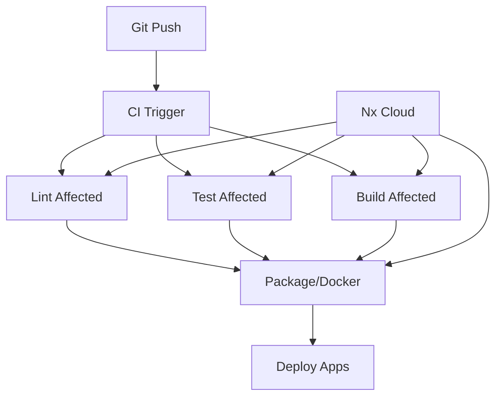
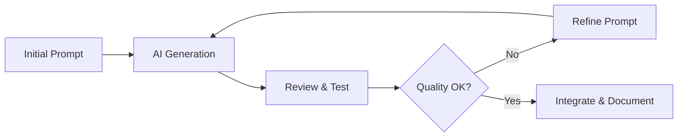

# A Development Plan for a Unified Polyglot Monorepo

> **Implementation Status**: This architectural plan was developed to guide the creation of a polyglot monorepo. As of June 8, 2025, **Phase 3 (Library Scaffolding) and Phase 4.1-4.6 (Application Scaffolding) have been completed** with fully functional generators supporting Python, PHP, TypeScript, iOS, and Android libraries, plus web applications, Python applications (Flask, Django, FastAPI), and PHP applications (Symfony, Laravel). **Generator Directory Reorganization Complete**: Templates are now properly organized by generator type (lib/ vs app/) with distinct concerns for libraries vs applications. **Production-Ready Status**: All implemented generators create 100% working applications without manual intervention, featuring automatic database initialization, Docker-first architecture, comprehensive API functionality, and consistent port strategy across all 5 major web frameworks.

## Phase 1: Foundation and Monorepo Strategy

### 1.1. Introduction to the Polyglot Monorepo Vision

The adoption of a monorepo architecture offers significant strategic advantages for organizations managing a diverse portfolio of applications and libraries. This approach, consolidating varied project types into a single repository, streamlines development workflows and fosters a more cohesive engineering environment. 

#### Key Benefits

- **Simplified dependency management** across projects
- **Enhanced code sharing and reusability**
- **Atomic commits** that span multiple projects
- **Streamlined CI/CD processes**

This unified structure is particularly beneficial for the envisioned system, which will house a wide array of applications (web, iOS, Android, PHP, Python) and libraries (UI, networking, utility).

#### Core Advantages

**Shared Code and Visibility**: A well-structured monorepo facilitates shared code and visibility, allowing development teams to keep code DRY (Don't Repeat Yourself) across the entire organization. Validation logic, UI components, and data types can be reused efficiently between:
- Backend services
- Frontend applications  
- Utility libraries

**Atomic Changes**: For instance, an API modification on a server can be committed alongside the corresponding changes in downstream applications that consume that API, all within a single commit. This drastically reduces the complexity of coordinating changes across multiple repositories.

**Developer Mobility**: Enhanced by providing a consistent method for building and testing applications, regardless of the underlying tools and technologies. This consistency allows developers to contribute to other teams' applications with greater confidence.

**Single Set of Dependencies**: Can be enforced, reducing inconsistencies and ensuring that even less actively developed applications are kept up-to-date with the latest framework and library versions.

#### Implementation Considerations

While the concept of a monorepo is increasingly popular, its successful implementation hinges on addressing specific organizational needs rather than merely following a trend. The true value of a monorepo, especially in a complex polyglot environment, is realized when its structure and tooling are meticulously aligned with the challenges of managing diverse projects.

> ⚠️ **Warning**: Without adequate tooling, a monorepo can devolve into simple "code collocation," leading to problems such as:
> - Running unnecessary tests across the entire codebase for minor changes
> - Lack of clear code boundaries
> - Inconsistent tooling across projects

#### AI-Driven Governance

The intention to employ an AI code generator for the creation and management of this monorepo introduces a powerful paradigm for governance. A monorepo designed to house a wide variety of technologies—web frameworks, native mobile platforms like iOS and Android, and backend languages such as PHP and Python—is inherently complex.

An AI, guided by a detailed and prescriptive plan like this one, can automate:
- Maintaining consistency
- Generating boilerplate code
- Managing inter-dependencies across disparate ecosystems

This automation ensures adherence to the defined architectural principles and best practices from the outset, effectively establishing the "well-defined relationships" that distinguish a true monorepo from mere code collocation.

### 1.2. Selecting the Primary Monorepo Management Tool: Nx

For a polyglot monorepo of this complexity and scale, **Nx** is recommended as the primary management tool.

#### Why Nx?

Nx provides a comprehensive suite of features tailored for monorepo development:

- 🔍 **Sophisticated project graph analysis**
- ⚡ **Efficient task orchestration**
- 💾 **Advanced caching mechanisms** (local and distributed)
- 🔌 **Rich plugin ecosystem**
- 🎯 **Powerful code generation capabilities**

#### Language Support

**JavaScript/TypeScript**: Nx has native strengths in managing JavaScript and TypeScript projects, which will form a significant part of the web application and UI library landscape.

**Python**: Support is provided through community plugins like `@nxlv/python`, which integrates with tools like Poetry and Uv, enabling robust dependency management and project scaffolding.

**PHP**: While official Nx support for PHP is less direct, community plugins such as `@nx-php/composer-plugin` offer a starting point. Furthermore, Nx's custom generator capabilities and the `nx:run-commands` executor allow for the integration of PHP-specific tooling.

**Native Mobile (Android)**: The `@nx/gradle` plugin facilitates the integration of Android projects, which are typically built using Gradle.

**Native Mobile (iOS)**: Direct plugin support for pure native iOS is not as mature, but Nx's extensible plugin architecture provides a solid foundation for creating custom Nx generators to scaffold and manage native iOS projects.

#### Comparison with Alternatives

| Tool | Key Strengths | Scaffolding Support | Extensibility | Learning Curve | Relevance |
|------|---------------|-------------------|---------------|----------------|-----------|
| **Nx** | Excellent plugin system, project graph, polyglot support | Strong via generators | High | Moderate | ⭐⭐⭐⭐⭐ |
| **Bazel** | Language-agnostic, hermetic builds, massive scale | Custom build rules | High | Steep | ⭐⭐⭐ |
| **Turborepo** | High-performance JS/TS, simple setup | JS/TS focused | Lower | Low | ⭐⭐ |
| **Lerna** | Package versioning/publishing | Limited | Moderate | Low | ⭐⭐ |

#### Nx as a Meta-Tool

The fundamental strength of Nx in this polyglot scenario lies in its capacity as a **"meta-tool."** It doesn't aim to replace native toolchains for each language, but instead provides an orchestration layer through its plugin and executor model.

```bash
# Unified command interface regardless of underlying technology
nx build my-python-app    # Delegates to Poetry/Uv
nx build my-ios-lib       # Delegates to xcodebuild  
nx test my-php-service    # Delegates to PHPUnit
nx lint my-web-app        # Delegates to ESLint
```

### 1.3. High-Level Architectural Principles

To guide the development of this polyglot monorepo, several high-level architectural principles must be established:

#### 1. Clear Separation of Concerns

- **Applications** (`apps/`): Deployable units
- **Libraries** (`libs/`): Reusable code modules

> 📊 **Best Practice**: Applications should contain ~20% of the codebase, with 80% residing in libraries. Even code not initially intended for sharing should be placed in libraries.

#### 2. Defined Public APIs for Libraries

Libraries must expose well-defined public APIs to prevent tight coupling:

```json
// Example: library index.ts exports
export { UserService } from './user-service';
export { DataValidator } from './validators';
// Internal implementation details are not exported
```

#### 3. Consistency in Tooling and Commands

Developers should use uniform commands across different project types:

```bash
nx build <project>   # Works for any project type
nx test <project>    # Consistent testing interface  
nx lint <project>    # Unified linting approach
```

#### 4. Scalability and Performance

Key performance optimizations:

- **Affected commands**: Only operate on impacted projects
- **Advanced caching**: Local and remote computation caching
- **Thin app principle**: Applications as lightweight wrappers

#### 5. Developer Experience (DX)

Priority areas for developer experience:

- ✅ Easy onboarding for new team members
- 🔍 Clear discoverability of code and shared libraries  
- ⚡ Efficient local development workflows
- 📋 Standardized project structures
- 🤖 Automated code generation

---

## Phase 2: Monorepo Setup and Core Structure

### 2.1. Initializing the Nx Workspace

The foundational step is initializing an Nx workspace with the following command:

```bash
npx create-nx-workspace@latest terrible-lizard --preset=empty
```

#### Why `--preset=empty`?

- 🧹 **Clean slate**: Avoids pre-installation of JavaScript-centric tooling
- 🎯 **Deliberate additions**: Allows incremental addition of language-specific plugins
- 🔧 **Flexibility**: Suitable for diverse polyglot requirements

#### Initial Structure Created

```
terrible-lizard/
├── nx.json                 # Nx workspace configuration
├── package.json            # Workspace dependencies
├── pnpm-lock.yaml         # Lock file (if using pnpm)
└── tsconfig.base.json     # Base TypeScript configuration
```

### 2.2. Establishing the Top-Level Directory Structure

```
terrible-lizard/
├── apps/                   # Deployable applications
│   ├── web-dashboard/
│   ├── mobile-ios/
│   ├── mobile-android/
│   ├── api-gateway/
│   └── data-processor/
├── libs/                   # Shared libraries
│   ├── ui/
│   ├── networking/
│   ├── utilities/
│   └── data-access/
├── tools/                  # Custom workspace tooling
│   ├── generators/
│   └── scripts/
├── docs/                   # Project documentation
└── config/                 # Shared configurations
```

#### Directory Purposes

| Directory | Purpose | Contents |
|-----------|---------|----------|
| `apps/` | Deployable applications | Web apps, mobile apps, APIs, services |
| `libs/` | Reusable libraries | UI components, utilities, business logic |
| `tools/` | Custom tooling | Nx generators, scripts, utilities |
| `docs/` | Documentation | Architecture docs, guides, ADRs |
| `config/` | Shared configurations | CI/CD templates, Docker configs |

### 2.3. Root-Level Configuration Files

#### Core Configuration Files

**`nx.json`** - Nx workspace configuration:
```json
{
  "plugins": [
    "@nxlv/python",
    "@nx/gradle", 
    "@nx-php/composer-plugin"
  ],
  "defaultBase": "main",
  "targetDefaults": {
    "build": {
      "cache": true
    },
    "test": {
      "cache": true
    }
  }
}
```

**`package.json`** - Workspace dependencies:
```json
{
  "name": "terrible-lizard",
  "scripts": {
    "build": "nx affected:build",
    "test": "nx affected:test",
    "lint": "nx affected:lint"
  },
  "devDependencies": {
    "nx": "^17.0.0",
    "@nxlv/python": "^latest",
    "@nx/gradle": "^latest"
  }
}
```

**`tsconfig.base.json`** - Base TypeScript configuration:
```json
{
  "compilerOptions": {
    "rootDir": ".",
    "sourceMap": true,
    "declaration": false,
    "moduleResolution": "node",
    "paths": {
      "@terrible-lizard/ui": ["libs/ui/src/index.ts"],
      "@terrible-lizard/networking": ["libs/networking/src/index.ts"]
    }
  }
}
```

#### Language-Specific Root Configurations

**Python** - `pyproject.toml`:
```toml
[tool.ruff]
line-length = 88
target-version = "py311"

[tool.ruff.lint]
select = ["E", "F", "W", "I", "N"]

[tool.pytest.ini_options]
testpaths = ["libs", "apps"]
python_files = ["test_*.py", "*_test.py"]
```

**PHP** - `.php-cs-fixer.dist.php`:
```php
<?php
return (new PhpCsFixer\Config())
    ->setRules([
        '@PSR12' => true,
        'array_syntax' => ['syntax' => 'short'],
        'ordered_imports' => true,
    ])
    ->setFinder(
        PhpCsFixer\Finder::create()
            ->in(['apps', 'libs'])
            ->name('*.php')
    );
```

### 2.4. Dependency Management Strategy

#### Language-Specific Approaches

| Language | Package Manager | Strategy | Configuration |
|----------|----------------|----------|---------------|
| **JS/TS** | pnpm/npm/yarn | Single version policy | Root `package.json` |
| **Python** | Poetry/Uv | Per-project with shared base | `pyproject.toml` per project |
| **PHP** | Composer | Per-project | `composer.json` per project |
| **iOS** | CocoaPods/SPM | Native tooling | `Podfile`/Xcode project |
| **Android** | Gradle | Native dependency management | `build.gradle` |

#### Nx's Role in Dependency Management

Nx acts as a **dependency relationship visualizer** and **task orchestrator** rather than a universal package manager:

- 📊 **Project Graph**: Understands relationships between projects
- ⚡ **Affected Commands**: Optimizes builds based on dependencies  
- 🔄 **Task Orchestration**: Coordinates builds across language boundaries

---

## Phase 3: Library Scaffolding (libs/)

Libraries form the reusable building blocks of the monorepo. Efficiently scaffolding these libraries with consistent structures and tooling is crucial.

### 3.1. Designing the CLI Command for Library Creation

A unified CLI command, intended to be interpreted and executed by the AI code generator, will be used to create new libraries.

#### Proposed Command

```bash
ai-gen create-lib <lib-name> --type <ui|networking|utility|python|php|ios-native|android-native> [--tags <tag1,tag2>] [--publishable] [--importPath <@scope/lib-name>] [--directory <path/to/lib>]
```

#### Parameters

| Parameter | Required | Description | Example |
|-----------|----------|-------------|---------|
| `<lib-name>` | ✅ | Name of the library | `user-auth`, `data-parser` |
| `--type` | ✅ | Library type | `ui`, `python`, `php`, `ios-native` |
| `--tags` | ❌ | Nx tags for organization | `scope:shared,type:data-access` |
| `--publishable` | ❌ | Intended for external distribution | Flag only |
| `--importPath` | ❌ | Package import path | `@my-org/common-ui` |
| `--directory` | ❌ | Subdirectory within libs/ | `shared/ui`, `mobile/ios` |

#### Library Types

- **`ui`**: JavaScript/TypeScript UI component library
- **`networking`**: Network request handling library
- **`utility`**: General-purpose utility library
- **`python`**: Python library with Poetry/Uv
- **`php`**: PHP library with Composer
- **`ios-native`**: Native iOS framework/static library
- **`android-native`**: Native Android library module

### 3.2. Implementing the Nx Generator for Libraries

A versatile Nx generator at `tools/generators/create-lib/index.ts` will implement the command logic.

#### Core Generator Structure

```typescript
// Common scaffolding for all library types
export default async function (tree: Tree, options: CreateLibSchema) {
  // 1. Create directory structure
  const projectRoot = `libs/${options.directory || ''}/${options.name}`;
  
  // 2. Generate project.json
  addProjectConfiguration(tree, options.name, {
    root: projectRoot,
    projectType: 'library',
    sourceRoot: `${projectRoot}/src`,
    tags: options.tags?.split(',') || [],
    targets: {
      // Language-specific targets added below
    }
  });
  
  // 3. Generate README.md
  generateFiles(tree, joinPathFragments(__dirname, 'files'), projectRoot, {
    ...options,
    template: ''
  });
  
  // 4. Language-specific scaffolding
  await scaffoldByType(tree, options);
  
  await formatFiles(tree);
}
```

#### Language-Specific Scaffolding

**JavaScript/TypeScript Libraries**

```typescript
case 'ui':
case 'networking':
case 'utility':
  // Leverage official Nx generators
  await libraryGenerator(tree, {
    name: options.name,
    directory: options.directory,
    importPath: options.importPath,
    publishable: options.publishable,
    buildable: true,
    testEnvironment: 'jsdom'
  });
  
  // Add additional UI-specific setup for 'ui' type
  if (options.type === 'ui') {
    await reactLibraryGenerator(tree, {
      name: options.name,
      style: 'css',
      component: true
    });
  }
  break;
```

**Python Libraries**

```typescript
case 'python':
  // Use @nxlv/python plugin
  await poetryProjectGenerator(tree, {
    name: options.name,
    projectType: 'library',
    packageName: options.importPath,
    moduleName: options.name.replace(/-/g, '_'),
    publishable: options.publishable
  });
  
  // Update project.json with Python-specific targets
  updateProjectConfiguration(tree, options.name, {
    targets: {
      build: {
        executor: '@nxlv/python:build'
      },
      test: {
        executor: '@nxlv/python:pytest'
      },
      lint: {
        executor: '@nxlv/python:ruff'
      }
    }
  });
  break;
```

**PHP Libraries**

```typescript
case 'php':
  // Custom PHP scaffolding
  generateFiles(tree, 
    joinPathFragments(__dirname, 'files/php-library'), 
    projectRoot, 
    {
      ...options,
      namespace: convertToPhpNamespace(options.importPath),
      phpVersion: '8.2'
    }
  );
  
  // Run composer install
  execSync('composer install', { 
    cwd: projectRoot, 
    stdio: 'inherit' 
  });
  
  // Add PHP-specific targets
  updateProjectConfiguration(tree, options.name, {
    targets: {
      test: {
        executor: 'nx:run-commands',
        options: {
          command: 'composer exec phpunit',
          cwd: projectRoot
        }
      },
      lint: {
        executor: 'nx:run-commands',
        options: {
          command: 'composer exec php-cs-fixer fix --dry-run --diff',
          cwd: projectRoot
        }
      }
    }
  });
  break;
```

**Native iOS Libraries**

```typescript
case 'ios-native':
  // Custom iOS framework scaffolding
  generateFiles(tree,
    joinPathFragments(__dirname, 'files/ios-library'),
    projectRoot,
    {
      ...options,
      bundleIdentifier: `com.myorg.${options.name}`,
      targetType: 'framework'
    }
  );
  
  // Add Xcode build targets
  updateProjectConfiguration(tree, options.name, {
    targets: {
      build: {
        executor: 'nx:run-commands',
        options: {
          command: `xcodebuild build -project ${options.name}.xcodeproj -scheme ${options.name} -configuration Debug -sdk iphonesimulator`,
          cwd: projectRoot
        }
      },
      test: {
        executor: 'nx:run-commands',
        options: {
          command: `xcodebuild test -project ${options.name}.xcodeproj -scheme ${options.name} -configuration Debug -sdk iphonesimulator -destination 'platform=iOS Simulator,name=iPhone 15'`,
          cwd: projectRoot
        }
      }
    }
  });
  break;
```

#### File Templates

**PHP Library Structure**

```
libs/my-php-lib/
├── src/
│   └── MyPhpLib.php
├── tests/
│   └── MyPhpLibTest.php
├── composer.json
├── phpunit.xml.dist
├── .php-cs-fixer.dist.php
└── README.md
```

**composer.json Template** (`files/php-library/composer.json.ejs`):

```json
{
  "name": "<%= importPath || `my-org/${name}` %>",
  "description": "Generated PHP library",
  "type": "library",
  "license": "MIT",
  "require": {
    "php": "^<%= phpVersion %>"
  },
  "require-dev": {
    "phpunit/phpunit": "^10.0",
    "friendsofphp/php-cs-fixer": "^3.0"
  },
  "autoload": {
    "psr-4": {
      "<%= namespace %>\\": "src/"
    }
  },
  "autoload-dev": {
    "psr-4": {
      "<%= namespace %>\\Tests\\": "tests/"
    }
  }
}
```

**iOS Library Structure**

```
libs/my-ios-lib/
├── MyIosLib.xcodeproj/
│   └── project.pbxproj
├── Sources/
│   └── MyIosLib.swift
├── Tests/
│   └── MyIosLibTests.swift
├── Info.plist
└── README.md
```

**Swift Library Template** (`files/ios-library/Sources/__name__.swift.ejs`):

```swift
import Foundation

/// <%= name %> library
@objc public class <%= className %> : NSObject {
    
    @objc public static let shared = <%= className %>()
    
    private override init() {
        super.init()
    }
    
    @objc public func hello() -> String {
        return "Hello from <%= name %>!"
    }
}
```

---

## Phase 4: Application Scaffolding (apps/)

Applications are the deployable units within the monorepo. The scaffolding process supports various application types with optional Dockerization.

### 4.1. Designing the CLI Commands for Application Creation

#### Proposed Command

```bash
ai-gen create-app <app-name> --type <web|ios-native|android-native|php|python> [--framework <react|angular|nextjs|nestjs|flask|django|symfony|laravel>] [--docker] [--tags <tag1,tag2>] [--directory <path/to/app>]
```

#### Application Scaffolding Matrix

| Type | Frameworks | Docker Default | Output |
|------|------------|----------------|--------|
| **web** | `react`, `angular`, `nextjs`, `nestjs` | ✅ | Runnable web application |
| **php** | `symfony`, `laravel` | ✅ | Dockerized PHP application |
| **python** | `flask`, `django`, `fastapi` | ✅ | Dockerized Python application |
| **ios-native** | N/A | ❌ | Xcode project |
| **android-native** | N/A | ❌ | Gradle project |

### 4.2. Web Application Scaffolding (--type web)

#### Implementation Strategy

```typescript
case 'web':
  if (options.framework) {
    // Use official Nx generators
    switch (options.framework) {
      case 'react':
        await reactApplicationGenerator(tree, {
          name: options.name,
          style: 'css',
          routing: true,
          bundler: 'vite'
        });
        break;
      case 'nextjs':
        await nextApplicationGenerator(tree, {
          name: options.name,
          style: 'css'
        });
        break;
      case 'nestjs':
        await nestApplicationGenerator(tree, {
          name: options.name
        });
        break;
    }
  }
  
  // Add Docker support if enabled
  if (options.docker) {
    await setupWebDocker(tree, options);
  }
  break;
```

#### Docker Configuration

**Multi-stage Dockerfile for React App**:

```dockerfile
# Build stage
FROM node:24-alpine AS builder
WORKDIR /app
COPY package*.json ./
RUN npm ci --only=production

COPY . .
RUN npm run build

# Production stage  
FROM nginx:alpine
COPY --from=builder /app/dist/apps/<%= name %> /usr/share/nginx/html
COPY nginx.conf /etc/nginx/nginx.conf
EXPOSE 80
CMD ["nginx", "-g", "daemon off;"]
```

**docker-compose.yml for Development**:

```yaml
version: '3.8'
services:
  <%= name %>:
    build: .
    ports:
      - "3000:3000"
    volumes:
      - .:/app
      - /app/node_modules
    environment:
      - NODE_ENV=development
    command: npm run serve
```

### 4.3. PHP Application Scaffolding (--type php)

#### Symfony Example Implementation

```typescript
case 'php':
  if (options.framework === 'symfony') {
    // Use Symfony CLI to create project
    execSync(`composer create-project symfony/skeleton ${projectRoot}`, {
      stdio: 'inherit'
    });
    
    // Integrate with Nx
    addProjectConfiguration(tree, options.name, {
      root: projectRoot,
      projectType: 'application',
      targets: {
        serve: {
          executor: 'nx:run-commands',
          options: {
            command: 'symfony server:start',
            cwd: projectRoot
          }
        },
        build: {
          executor: 'nx:run-commands',
          options: {
            command: 'composer install --no-dev --optimize-autoloader',
            cwd: projectRoot
          }
        }
      }
    });
  }
  
  // Add Docker support
  if (options.docker) {
    await setupPhpDocker(tree, options);
  }
  break;
```

#### PHP Docker Configuration

**Dockerfile for Symfony**:

```dockerfile
# Composer stage
FROM composer:2 AS composer_install
WORKDIR /app
COPY composer.json composer.lock ./
RUN composer install --no-dev --optimize-autoloader --no-interaction

# PHP-FPM stage
FROM php:8.2-fpm-alpine
RUN apk add --no-cache nginx

# Copy application
WORKDIR /var/www/html
COPY --from=composer_install /app/vendor ./vendor
COPY . .

# Configure Nginx
COPY docker/nginx.conf /etc/nginx/nginx.conf
COPY docker/default.conf /etc/nginx/conf.d/default.conf

EXPOSE 80
CMD ["sh", "-c", "php-fpm -D && nginx -g 'daemon off;'"]
```

**docker-compose.yml for PHP Development**:

```yaml
version: '3.8'
services:
  app:
    build: .
    ports:
      - "8080:80"
    volumes:
      - .:/var/www/html
      - ./docker/php.ini:/usr/local/etc/php/php.ini
    depends_on:
      - database
    
  database:
    image: mysql:8.0
    environment:
      MYSQL_ROOT_PASSWORD: secret
      MYSQL_DATABASE: <%= name %>
    volumes:
      - mysql_data:/var/lib/mysql
    ports:
      - "3306:3306"

volumes:
  mysql_data:
```

### 4.4. Python Application Scaffolding (--type python)

#### Flask Example Implementation

```typescript
case 'python':
  // Use @nxlv/python for base setup
  await poetryProjectGenerator(tree, {
    name: options.name,
    projectType: 'application',
    pyprojectPythonDependency: '^3.11'
  });
  
  if (options.framework === 'flask') {
    // Add Flask-specific structure
    generateFiles(tree,
      joinPathFragments(__dirname, 'files/python-flask'),
      projectRoot,
      options
    );
    
    // Update pyproject.toml with Flask dependencies
    const pyprojectPath = joinPathFragments(projectRoot, 'pyproject.toml');
    const pyproject = readProjectConfiguration(tree, options.name);
    // Add Flask dependencies logic here
  }
  
  if (options.docker) {
    await setupPythonDocker(tree, options);
  }
  break;
```

#### Python Flask Structure

```
apps/my-python-app/
├── src/
│   ├── __init__.py
│   ├── app.py
│   ├── config.py
│   └── routes/
│       ├── __init__.py
│       └── main.py
├── tests/
│   └── test_app.py
├── pyproject.toml
├── Dockerfile
├── docker-compose.yml
└── README.md
```

**Flask app.py Template**:

```python
from flask import Flask
from src.routes.main import main_bp

def create_app():
    app = Flask(__name__)
    app.config.from_object('src.config.Config')
    
    # Register blueprints
    app.register_blueprint(main_bp)
    
    return app

if __name__ == '__main__':
    app = create_app()
    app.run(host='0.0.0.0', port=5000, debug=True)
```

#### Python Docker Configuration

**Dockerfile for Flask**:

```dockerfile
# Build stage
FROM python:3.11-slim AS builder
WORKDIR /app
RUN pip install poetry

COPY pyproject.toml poetry.lock ./
RUN poetry config virtualenvs.create false && \
    poetry install --no-dev --no-interaction --no-ansi

# Runtime stage
FROM python:3.11-slim
WORKDIR /app

COPY --from=builder /usr/local/lib/python3.11/site-packages /usr/local/lib/python3.11/site-packages
COPY --from=builder /usr/local/bin /usr/local/bin

COPY src/ ./src/
COPY pyproject.toml ./

EXPOSE 5000
CMD ["python", "-m", "gunicorn", "--bind", "0.0.0.0:5000", "src.app:create_app()"]
```

### 4.5. Native iOS Application Scaffolding (--type ios-native)

#### Implementation Strategy

```typescript
case 'ios-native':
  // Generate Xcode project structure
  generateFiles(tree,
    joinPathFragments(__dirname, 'files/ios-app'),
    projectRoot,
    {
      ...options,
      bundleIdentifier: `com.myorg.${options.name}`,
      deploymentTarget: '15.0'
    }
  );
  
  // Configure Nx targets for Xcode
  addProjectConfiguration(tree, options.name, {
    root: projectRoot,
    projectType: 'application',
    targets: {
      build: {
        executor: 'nx:run-commands',
        options: {
          command: `xcodebuild build -project ${options.name}.xcodeproj -scheme ${options.name} -configuration Debug -sdk iphonesimulator`
        }
      },
      'run-ios': {
        executor: 'nx:run-commands',
        options: {
          command: `xcodebuild build -project ${options.name}.xcodeproj -scheme ${options.name} -configuration Debug -sdk iphonesimulator -destination 'platform=iOS Simulator,name=iPhone 15' && open -a Simulator`
        }
      },
      test: {
        executor: 'nx:run-commands',
        options: {
          command: `xcodebuild test -project ${options.name}.xcodeproj -scheme ${options.name} -configuration Debug -sdk iphonesimulator -destination 'platform=iOS Simulator,name=iPhone 15'`
        }
      }
    }
  });
  break;
```

#### iOS Project Structure

```
apps/my-ios-app/
├── MyIosApp.xcodeproj/
│   ├── project.pbxproj
│   └── xcshareddata/
├── MyIosApp/
│   ├── AppDelegate.swift
│   ├── SceneDelegate.swift
│   ├── ViewController.swift
│   ├── Main.storyboard
│   ├── LaunchScreen.storyboard
│   ├── Assets.xcassets/
│   └── Info.plist
├── MyIosAppTests/
│   └── MyIosAppTests.swift
└── README.md
```

### 4.6. Native Android Application Scaffolding (--type android-native)

#### Implementation Strategy

```typescript
case 'android-native':
  // Initialize Gradle project
  execSync(`gradle init --type kotlin-application --dsl kotlin --project-name ${options.name}`, {
    cwd: projectRoot,
    stdio: 'inherit'
  });
  
  // Convert to Android project
  await convertToAndroidProject(tree, projectRoot, options);
  
  // Configure Nx with @nx/gradle
  addProjectConfiguration(tree, options.name, {
    root: projectRoot,
    projectType: 'application',
    targets: {
      build: {
        executor: '@nx/gradle:gradle',
        options: {
          task: 'assembleDebug'
        }
      },
      test: {
        executor: '@nx/gradle:gradle',
        options: {
          task: 'testDebugUnitTest'
        }
      },
      'run-android': {
        executor: 'nx:run-commands',
        options: {
          command: './gradlew installDebug && adb shell am start -n com.myorg.${options.name}/.MainActivity'
        }
      }
    }
  });
  break;
```

#### Android Project Structure

```
apps/my-android-app/
├── build.gradle.kts
├── settings.gradle.kts
├── app/
│   ├── build.gradle.kts
│   ├── src/
│   │   ├── main/
│   │   │   ├── kotlin/com/myorg/myandroidapp/
│   │   │   │   └── MainActivity.kt
│   │   │   ├── res/
│   │   │   │   ├── layout/
│   │   │   │   │   └── activity_main.xml
│   │   │   │   └── values/
│   │   │   │       └── strings.xml
│   │   │   └── AndroidManifest.xml
│   │   ├── test/
│   │   │   └── kotlin/
│   │   └── androidTest/
│   │       └── kotlin/
├── gradle/
│   └── wrapper/
├── gradlew
├── gradlew.bat
└── README.md
```

**build.gradle.kts Template**:

```kotlin
plugins {
    id("com.android.application")
    id("org.jetbrains.kotlin.android")
}

android {
    namespace = "com.myorg.<%= name.replace(/-/g, '') %>"
    compileSdk = 34

    defaultConfig {
        applicationId = "com.myorg.<%= name.replace(/-/g, '') %>"
        minSdk = 24
        targetSdk = 34
        versionCode = 1
        versionName = "1.0"

        testInstrumentationRunner = "androidx.test.runner.AndroidJUnitRunner"
    }

    buildTypes {
        release {
            isMinifyEnabled = false
            proguardFiles(getDefaultProguardFile("proguard-android-optimize.txt"), "proguard-rules.pro")
        }
    }

    compileOptions {
        sourceCompatibility = JavaVersion.VERSION_1_8
        targetCompatibility = JavaVersion.VERSION_1_8
    }

    kotlinOptions {
        jvmTarget = "1.8"
    }
}

dependencies {
    implementation("androidx.core:core-ktx:1.12.0")
    implementation("androidx.appcompat:appcompat:1.6.1")
    implementation("com.google.android.material:material:1.11.0")
    implementation("androidx.constraintlayout:constraintlayout:2.1.4")
    
    testImplementation("junit:junit:4.13.2")
    androidTestImplementation("androidx.test.ext:junit:1.1.5")
    androidTestImplementation("androidx.test.espresso:espresso-core:3.5.1")
}
```

---

## Phase 5: Build, Test, and Lint Integration

Once applications and libraries are scaffolded, integrating their build, test, and linting processes into the Nx managed environment is crucial for consistency and efficiency.

### 5.1. Configuring Nx Targets in project.json

Each generated application and library will have a `project.json` file that defines how Nx interacts with it.

#### Standard Targets

| Target | Purpose | Examples |
|--------|---------|----------|
| **`build`** | Compile and bundle | `webpack`, `tsc`, `poetry build`, `xcodebuild` |
| **`serve`** | Development server | `Vite dev`, `php -S`, `flask run` |
| **`test`** | Unit tests | `Jest`, `Pytest`, `PHPUnit`, `XCTest` |
| **`lint`** | Code analysis | `ESLint`, `Ruff`, `PHP CS Fixer`, `SwiftLint` |

#### Additional Targets

- **`docker-build`**: Build Docker images
- **`package`**: Create publishable packages
- **`run-ios`/`run-android`**: Mobile app deployment
- **`install`**: Dependency installation

#### Example project.json Configuration

**JavaScript/TypeScript Library**:

```json
{
  "name": "ui-components",
  "root": "libs/ui-components",
  "projectType": "library",
  "sourceRoot": "libs/ui-components/src",
  "targets": {
    "build": {
      "executor": "@nx/js:tsc",
      "outputs": ["{options.outputPath}"],
      "options": {
        "outputPath": "dist/libs/ui-components",
        "main": "libs/ui-components/src/index.ts",
        "tsConfig": "libs/ui-components/tsconfig.lib.json"
      }
    },
    "test": {
      "executor": "@nx/jest:jest",
      "outputs": ["{workspaceRoot}/coverage/{projectRoot}"],
      "options": {
        "jestConfig": "libs/ui-components/jest.config.ts"
      }
    },
    "lint": {
      "executor": "@nx/eslint:lint",
      "outputs": ["{options.outputFile}"],
      "options": {
        "lintFilePatterns": ["libs/ui-components/**/*.{ts,tsx,js,jsx}"]
      }
    }
  },
  "tags": ["scope:shared", "type:ui"]
}
```

**Python Application**:

```json
{
  "name": "data-processor",
  "root": "apps/data-processor",
  "projectType": "application",
  "sourceRoot": "apps/data-processor/src",
  "targets": {
    "build": {
      "executor": "@nxlv/python:build",
      "outputs": ["{projectRoot}/dist"],
      "options": {
        "outputPath": "dist/apps/data-processor",
        "publish": false
      }
    },
    "serve": {
      "executor": "nx:run-commands",
      "options": {
        "command": "poetry run python -m src.app",
        "cwd": "apps/data-processor"
      }
    },
    "test": {
      "executor": "@nxlv/python:pytest",
      "outputs": ["{workspaceRoot}/coverage/{projectRoot}"],
      "options": {
        "testPath": "apps/data-processor/tests"
      }
    },
    "lint": {
      "executor": "@nxlv/python:ruff",
      "options": {
        "lintPath": "apps/data-processor/src"
      }
    },
    "docker-build": {
      "executor": "nx:run-commands",
      "options": {
        "command": "docker build -t data-processor:latest .",
        "cwd": "apps/data-processor"
      }
    }
  },
  "tags": ["scope:backend", "type:api"]
}
```

**iOS Native Application**:

```json
{
  "name": "mobile-ios",
  "root": "apps/mobile-ios",
  "projectType": "application",
  "targets": {
    "build": {
      "executor": "nx:run-commands",
      "options": {
        "command": "xcodebuild build -project MobileIos.xcodeproj -scheme MobileIos -configuration Debug -sdk iphonesimulator",
        "cwd": "apps/mobile-ios"
      }
    },
    "test": {
      "executor": "nx:run-commands",
      "options": {
        "command": "xcodebuild test -project MobileIos.xcodeproj -scheme MobileIos -configuration Debug -sdk iphonesimulator -destination 'platform=iOS Simulator,name=iPhone 15'",
        "cwd": "apps/mobile-ios"
      }
    },
    "run-ios": {
      "executor": "nx:run-commands",
      "options": {
        "command": "xcodebuild build -project MobileIos.xcodeproj -scheme MobileIos -configuration Debug -sdk iphonesimulator && open -a Simulator",
        "cwd": "apps/mobile-ios"
      }
    },
    "lint": {
      "executor": "nx:run-commands",
      "options": {
        "command": "swiftlint",
        "cwd": "apps/mobile-ios"
      }
    }
  },
  "tags": ["scope:mobile", "type:app", "platform:ios"]
}
```

#### Caching Configuration

To leverage Nx's computation caching:

```json
{
  "targets": {
    "build": {
      "executor": "@nx/js:tsc",
      "inputs": [
        "default",
        "^default",
        "{workspaceRoot}/tsconfig.base.json"
      ],
      "outputs": ["{options.outputPath}"],
      "cache": true
    }
  }
}
```

### 5.2. Shared Linting and Formatting Configurations

Maintaining code quality across a polyglot monorepo requires hierarchical configuration strategies.

#### JavaScript/TypeScript Configuration

**Root `.eslintrc.json`**:

```json
{
  "root": true,
  "ignorePatterns": ["**/*"],
  "plugins": ["@nx"],
  "overrides": [
    {
      "files": ["*.ts", "*.tsx", "*.js", "*.jsx"],
      "rules": {
        "@nx/enforce-module-boundaries": [
          "error",
          {
            "enforceBuildableLibDependency": true,
            "allow": [],
            "depConstraints": [
              {
                "sourceTag": "*",
                "onlyDependOnLibsWithTags": ["*"]
              }
            ]
          }
        ]
      }
    }
  ]
}
```

**Project-level `.eslintrc.json`** (extends root):

```json
{
  "extends": ["../../.eslintrc.json"],
  "ignorePatterns": ["!**/*"],
  "overrides": [
    {
      "files": ["*.ts", "*.tsx"],
      "rules": {
        "@typescript-eslint/no-unused-vars": "error",
        "prefer-const": "error"
      }
    }
  ]
}
```

#### Python Configuration

**Root `pyproject.toml`**:

```toml
[tool.ruff]
line-length = 88
target-version = "py311"
extend-exclude = ["migrations"]

[tool.ruff.lint]
select = [
    "E",  # pycodestyle errors
    "W",  # pycodestyle warnings  
    "F",  # Pyflakes
    "I",  # isort
    "N",  # pep8-naming
    "UP", # pyupgrade
    "B",  # flake8-bugbear
]

ignore = [
    "E501",  # line too long (handled by formatter)
    "B008",  # do not perform function calls in argument defaults
]

[tool.ruff.format]
quote-style = "double"
indent-style = "space"
skip-magic-trailing-comma = false

[tool.pytest.ini_options]
testpaths = ["apps", "libs"]
python_files = ["test_*.py", "*_test.py"]
python_classes = ["Test*"]
python_functions = ["test_*"]
addopts = [
    "--strict-markers",
    "--strict-config",
    "--cov-report=term-missing:skip-covered",
    "--cov-report=xml",
    "--cov-report=html",
]
```

**Project-level `pyproject.toml`** (extends root):

```toml
[tool.ruff]
extend = "../../pyproject.toml"

[tool.ruff.lint]
# Project-specific overrides
ignore = ["N806"]  # Allow non-lowercase variable names

[tool.pytest.ini_options]
# Extend root configuration
testpaths = ["tests"]
markers = [
    "integration: marks tests as integration tests",
    "unit: marks tests as unit tests"
]
```

#### PHP Configuration

**Root `.php-cs-fixer.dist.php`**:

```php
<?php

$finder = PhpCsFixer\Finder::create()
    ->in(['apps', 'libs'])
    ->name('*.php')
    ->notPath('vendor')
    ->notPath('var/cache')
    ->notPath('var/log');

return (new PhpCsFixer\Config())
    ->setRules([
        '@PSR12' => true,
        '@Symfony' => true,
        'array_syntax' => ['syntax' => 'short'],
        'ordered_imports' => [
            'sort_algorithm' => 'alpha',
            'imports_order' => ['class', 'function', 'const']
        ],
        'no_unused_imports' => true,
        'trailing_comma_in_multiline' => true,
        'phpdoc_align' => ['align' => 'left'],
    ])
    ->setFinder($finder)
    ->setRiskyAllowed(true);
```

#### Native Mobile Configuration

**iOS - Root `.swiftlint.yml`**:

```yaml
disabled_rules:
  - trailing_whitespace
  - function_parameter_count

opt_in_rules:
  - empty_count
  - empty_string
  - force_unwrapping
  - implicitly_unwrapped_optional

included:
  - apps
  - libs

excluded:
  - Carthage
  - Pods
  - DerivedData

line_length:
  warning: 120
  error: 150

function_body_length:
  warning: 50
  error: 100

type_body_length:
  warning: 300
  error: 500

file_length:
  warning: 500
  error: 1000

identifier_name:
  min_length:
    warning: 1
    error: 1
  max_length:
    warning: 50
    error: 60
```

**Android - Root `.editorconfig`**:

```ini
# EditorConfig is awesome: https://EditorConfig.org

root = true

[*]
charset = utf-8
end_of_line = lf
indent_style = space
indent_size = 4
insert_final_newline = true
trim_trailing_whitespace = true

[*.{kt,kts}]
max_line_length = 120

[*.{xml,gradle}]
indent_size = 4

[*.{yml,yaml}]
indent_size = 2

[*.md]
trim_trailing_whitespace = false
```

### 5.3. Testing Strategies

Comprehensive testing across the polyglot monorepo requires tailored approaches for each technology stack.

#### Testing Levels

| Level | Focus | Tools by Language |
|-------|-------|-------------------|
| **Unit** | Individual components/functions | Jest/Vitest (JS/TS), Pytest (Python), PHPUnit (PHP), XCTest (iOS), JUnit (Android) |
| **Integration** | Component interactions | Supertest (Node.js), TestClient (FastAPI), Browser Tests (Symfony), Quick/Nimble (iOS), Espresso (Android) |
| **E2E** | Full application flows | Cypress/Playwright (Web), XCUITest (iOS), Espresso/UIAutomator (Android) |

#### Testing Configuration Examples

**JavaScript/TypeScript - Jest Configuration**:

```typescript
// libs/ui-components/jest.config.ts
export default {
  displayName: 'ui-components',
  preset: '../../jest.preset.js',
  setupFilesAfterEnv: ['<rootDir>/src/test-setup.ts'],
  coverageDirectory: '../../coverage/libs/ui-components',
  transform: {
    '^.+\\.(ts|mjs|js|html)$': [
      'jest-preset-angular',
      {
        tsconfig: '<rootDir>/tsconfig.spec.json',
        stringifyContentPathRegex: '\\.(html|svg)$',
      },
    ],
  },
  transformIgnorePatterns: ['node_modules/(?!.*\\.mjs$)'],
  snapshotSerializers: [
    'jest-preset-angular/build/serializers/no-ng-attributes',
    'jest-preset-angular/build/serializers/ng-snapshot',
    'jest-preset-angular/build/serializers/html-comment',
  ],
  collectCoverageFrom: [
    'src/**/*.{ts,tsx}',
    '!src/**/*.d.ts',
    '!src/test-setup.ts',
  ],
  coverageThreshold: {
    global: {
      branches: 80,
      functions: 80,
      lines: 80,
      statements: 80,
    },
  },
};
```

**Python - Pytest Configuration in pyproject.toml**:

```toml
[tool.pytest.ini_options]
testpaths = ["tests"]
python_files = ["test_*.py", "*_test.py"]
python_classes = ["Test*"]
python_functions = ["test_*"]
addopts = [
    "--cov=<%= moduleName || name.replace(/-/g, '_') %>",
    "--cov-report=term-missing",
    "--cov-report=xml",
    "--cov-fail-under=90"
]
markers = [
    "unit: Unit tests",
    "integration: Integration tests",
    "e2e: End-to-end tests",
    "slow: Slow running tests",
]
filterwarnings = [
    "error",
    "ignore::UserWarning",
    "ignore::DeprecationWarning",
]

[tool.coverage.run]
source = ["src"]
omit = [
    "*/tests/*",
    "*/test_*.py",
    "*/__pycache__/*",
    "*/migrations/*",
]

[tool.coverage.report]
exclude_lines = [
    "pragma: no cover",
    "def __repr__",
    "raise AssertionError",
    "raise NotImplementedError",
    "if __name__ == .__main__.:",
]
```

**PHP - PHPUnit Configuration**:

```xml
<!-- apps/api-gateway/phpunit.xml.dist -->
<?xml version="1.0" encoding="UTF-8"?>
<phpunit xmlns:xsi="http://www.w3.org/2001/XMLSchema-instance"
         xsi:noNamespaceSchemaLocation="https://schema.phpunit.de/10.0/phpunit.xsd"
         bootstrap="vendor/autoload.php"
         colors="true"
         executionOrder="depends,defects"
         failOnWarning="true"
         failOnRisky="true"
         failOnEmptyTestSuite="true"
         beStrictAboutOutputDuringTests="true"
         cacheDirectory=".phpunit.cache"
         backupGlobals="false">
    
    <testsuites>
        <testsuite name="unit">
            <directory>tests/Unit</directory>
        </testsuite>
        <testsuite name="integration">
            <directory>tests/Integration</directory>
        </testsuite>
    </testsuites>

    <source>
        <include>
            <directory>src</directory>
        </include>
        <exclude>
            <directory>src/Migrations</directory>
        </exclude>
    </source>

    <coverage>
        <report>
            <html outputDirectory="coverage/html"/>
            <xml outputDirectory="coverage/xml"/>
            <clover outputFile="coverage/clover.xml"/>
        </report>
    </coverage>

    <logging>
        <junit outputFile="coverage/junit.xml"/>
    </logging>
</phpunit>
```

#### E2E Testing Integration

**Cypress for Web Applications**:

```typescript
// apps/web-dashboard/cypress.config.ts
import { defineConfig } from 'cypress';
import { nxE2EPreset } from '@nx/cypress/plugins/cypress-preset';

export default defineConfig({
  e2e: {
    ...nxE2EPreset(__filename, {
      cypressDir: 'cypress',
      webServerCommands: {
        default: 'nx run web-dashboard:serve',
        production: 'nx run web-dashboard:preview',
      },
      ciWebServerCommand: 'nx run web-dashboard:serve-static',
    }),
    baseUrl: 'http://localhost:3000',
  },
});
```

---

## Phase 6: Custom Nx Generator Development (tools/generators/)

To support the diverse range of project types, custom Nx generators are essential for the AI-driven scaffolding system.

### 6.1. Guiding the AI to Create Custom Nx Generators

#### Generator Structure

Each custom generator follows a standardized structure:

```
tools/generators/create-lib/
├── index.ts              # Main generator logic
├── schema.json          # Parameter definitions
├── schema.d.ts          # TypeScript interfaces
└── files/               # Template files
    ├── common/
    ├── javascript/
    ├── python/
    ├── php/
    └── native/
```

#### Core @nx/devkit API Usage

**Essential Functions**:

```typescript
import {
  Tree,
  formatFiles,
  installPackagesTask,
  generateFiles,
  addProjectConfiguration,
  updateProjectConfiguration,
  readProjectConfiguration,
  joinPathFragments,
  names
} from '@nx/devkit';
```

**Example Generator Implementation**:

```typescript
// tools/generators/create-lib/index.ts
import { Tree, formatFiles, installPackagesTask, generateFiles } from '@nx/devkit';
import { CreateLibSchema } from './schema';

export default async function (tree: Tree, options: CreateLibSchema) {
  const normalizedOptions = normalizeOptions(tree, options);
  
  // 1. Add project configuration
  addProjectConfiguration(tree, normalizedOptions.name, {
    root: normalizedOptions.projectRoot,
    projectType: 'library',
    sourceRoot: `${normalizedOptions.projectRoot}/src`,
    tags: normalizedOptions.tags,
    targets: getTargetsForType(normalizedOptions.type)
  });

  // 2. Generate files from templates
  generateFiles(
    tree,
    joinPathFragments(__dirname, 'files', normalizedOptions.type),
    normalizedOptions.projectRoot,
    {
      ...normalizedOptions,
      className: names(normalizedOptions.name).className,
      propertyName: names(normalizedOptions.name).propertyName,
      template: ''
    }
  );

  // 3. Run type-specific logic
  await handleTypeSpecificLogic(tree, normalizedOptions);

  // 4. Format files and install packages
  await formatFiles(tree);
  return installPackagesTask(tree);
}
```

#### Schema Definition

**schema.json**:

```json
{
  "$schema": "http://json-schema.org/schema",
  "cli": "nx",
  "id": "CreateLib",
  "title": "Create a Library",
  "description": "Create a new library in the monorepo",
  "type": "object",
  "properties": {
    "name": {
      "type": "string",
      "description": "Library name",
      "$default": {
        "$source": "argv",
        "index": 0
      },
      "x-prompt": "What name would you like to use for the library?"
    },
    "type": {
      "type": "string",
      "description": "Library type",
      "enum": ["ui", "networking", "utility", "python", "php", "ios-native", "android-native"],
      "x-prompt": {
        "message": "What type of library is this?",
        "type": "list",
        "items": [
          { "value": "ui", "label": "UI Component Library (JS/TS)" },
          { "value": "networking", "label": "Networking Library" },
          { "value": "utility", "label": "Utility Library" },
          { "value": "python", "label": "Python Library" },
          { "value": "php", "label": "PHP Library" },
          { "value": "ios-native", "label": "Native iOS Library" },
          { "value": "android-native", "label": "Native Android Library" }
        ]
      }
    },
    "directory": {
      "type": "string",
      "description": "A directory where the library is placed"
    },
    "tags": {
      "type": "string",
      "description": "Add tags to the library (used for linting)"
    },
    "publishable": {
      "type": "boolean",
      "description": "Generate a publishable library",
      "default": false
    },
    "importPath": {
      "type": "string",
      "description": "The library name used to import it (e.g. @myorg/my-awesome-lib)"
    }
  },
  "required": ["name", "type"]
}
```

**schema.d.ts**:

```typescript
export interface CreateLibSchema {
  name: string;
  type: 'ui' | 'networking' | 'utility' | 'python' | 'php' | 'ios-native' | 'android-native';
  directory?: string;
  tags?: string;
  publishable?: boolean;
  importPath?: string;
}
```

### 6.2. File Templating for Polyglot Configuration

#### Template Organization

```
tools/generators/create-lib/files/
├── common/                    # Shared across all types
│   └── README.md.ejs
├── javascript/               # JS/TS specific
│   ├── src/
│   │   └── index.ts.ejs
│   ├── package.json.ejs
│   └── tsconfig.lib.json.ejs
├── python/                   # Python specific
│   ├── src/
│   │   └── __init__.py.ejs
│   ├── tests/
│   │   └── test___name__.py.ejs
│   └── pyproject.toml.ejs
├── php/                      # PHP specific
│   ├── src/
│   │   └── __className__.php.ejs
│   ├── tests/
│   │   └── __className__Test.php.ejs
│   ├── composer.json.ejs
│   └── phpunit.xml.dist.ejs
└── native/                   # Native mobile
    ├── ios/
    │   ├── Sources/
    │   │   └── __className__.swift.ejs
    │   ├── Tests/
    │   │   └── __className__Tests.swift.ejs
    │   ├── Info.plist.ejs
    │   └── __name__.xcodeproj/
    └── android/
        ├── src/main/kotlin/
        │   └── __className__.kt.ejs
        ├── src/test/kotlin/
        │   └── __className__Test.kt.ejs
        └── build.gradle.kts.ejs
```

#### Template Examples

**PHP Library Template** (`php/composer.json.ejs`):

```json
{
  "name": "<%= importPath || `my-org/${name}` %>",
  "description": "<%= description || `Generated PHP library: ${name}` %>",
  "type": "library",
  "license": "MIT",
  "authors": [
    {
      "name": "Your Organization",
      "email": "dev@yourorg.com"
    }
  ],
  "require": {
    "php": "^<%= phpVersion %>"
  },
  "require-dev": {
    "phpunit/phpunit": "^10.0",
    "friendsofphp/php-cs-fixer": "^3.0",
    "psalm/plugin-phpunit": "^0.18",
    "vimeo/psalm": "^5.0"
  },
  "autoload": {
    "psr-4": {
      "<%= namespace %>\\": "src/"
    }
  },
  "autoload-dev": {
    "psr-4": {
      "<%= namespace %>\\Tests\\": "tests/"
    }
  },
  "scripts": {
    "test": "phpunit",
    "test:coverage": "phpunit --coverage-html coverage",
    "lint": "php-cs-fixer fix --dry-run --diff",
    "lint:fix": "php-cs-fixer fix",
    "psalm": "psalm"
  },
  "config": {
    "sort-packages": true,
    "allow-plugins": {
      "phpunit/phpunit": true
    }
  }
}
```

**iOS Library Template** (`ios/Sources/__className__.swift.ejs`):

```swift
//
//  <%= className %>.swift
//  <%= name %>
//
//  Created by Code Generator
//

import Foundation

/// <%= description || `Main class for ${name} library` %>
@objc public class <%= className %>: NSObject {
    
    /// Shared instance
    @objc public static let shared = <%= className %>()
    
    /// Private initializer to enforce singleton pattern
    private override init() {
        super.init()
    }
    
    /// Example method
    /// - Returns: A greeting string
    @objc public func hello() -> String {
        return "Hello from <%= name %>!"
    }
    
    /// Example method with parameter
    /// - Parameter name: The name to greet
    /// - Returns: A personalized greeting
    @objc public func greet(name: String) -> String {
        return "Hello, \(name), from <%= className %>!"
    }
}

<% if (includeProtocol) { %>
/// Protocol defining the public interface
@objc public protocol <%= className %>Protocol {
    func hello() -> String
    func greet(name: String) -> String
}

// MARK: - Protocol Conformance
extension <%= className %>: <%= className %>Protocol {}
<% } %>
```

**Python Library Template** (`python/pyproject.toml.ejs`):

```toml
[build-system]
requires = ["poetry-core"]
build-backend = "poetry.core.masonry.api"

[tool.poetry]
name = "<%= importPath || name.replace(/-/g, '_') %>"
version = "0.1.0"
description = "<%= description || `Generated Python library: ${name}` %>"
authors = ["Your Organization <dev@yourorg.com>"]
license = "MIT"
readme = "README.md"
packages = [{include = "<%= moduleName || name.replace(/-/g, '_') %>", from = "src"}]

[tool.poetry.dependencies]
python = "^<%= pythonVersion || '3.11' %>"

[tool.poetry.group.dev.dependencies]
pytest = "^7.0"
pytest-cov = "^4.0"
ruff = "^0.1"
mypy = "^1.0"
black = "^23.0"

[tool.ruff]
extend = "../../pyproject.toml"
src = ["src"]

[tool.ruff.lint]
# Library-specific linting rules
extend-ignore = ["D100", "D104"]  # Allow missing docstrings in some cases

[tool.pytest.ini_options]
testpaths = ["tests"]
python_files = ["test_*.py", "*_test.py"]
python_classes = ["Test*"]
python_functions = ["test_*"]
addopts = [
    "--strict-markers",
    "--strict-config",
    "--cov-report=term-missing",
    "--cov-report=xml",
    "--cov-report=html:htmlcov",
    "--cov-fail-under=90"
]
markers = [
    "unit: Unit tests",
    "integration: Integration tests",
    "e2e: End-to-end tests",
    "slow: Slow running tests",
]
filterwarnings = [
    "error",
    "ignore::UserWarning",
    "ignore::DeprecationWarning",
]

[tool.coverage.run]
source = ["src"]
omit = [
    "*/tests/*",
    "*/test_*.py",
    "*/__pycache__/*",
    "*/migrations/*",
]

[tool.coverage.report]
exclude_lines = [
    "pragma: no cover",
    "def __repr__",
    "raise AssertionError",
    "raise NotImplementedError",
    "if __name__ == .__main__.:",
]
```

### 6.3. Running Shell Commands within Generators

For tasks requiring native tooling integration:

#### Implementation Pattern

```typescript
import { execSync } from 'child_process';

async function handlePhpLibrary(tree: Tree, options: NormalizedSchema) {
  const projectRoot = options.projectRoot;
  
  try {
    // Run composer install after generating composer.json
    execSync('composer install', {
      cwd: projectRoot,
      stdio: 'inherit',
      timeout: 30000 // 30 seconds timeout
    });
    
    // Generate autoload files
    execSync('composer dump-autoload', {
      cwd: projectRoot,
      stdio: 'inherit'
    });
    
    console.log(`✅ PHP library ${options.name} initialized successfully`);
  } catch (error) {
    console.error(`❌ Failed to initialize PHP library: ${error.message}`);
    // Don't throw - let the user handle manually
  }
}

async function handlePythonLibrary(tree: Tree, options: NormalizedSchema) {
  const projectRoot = options.projectRoot;
  
  try {
    // Initialize Poetry if pyproject.toml was generated
    execSync('poetry install', {
      cwd: projectRoot,
      stdio: 'inherit',
      timeout: 60000 // Longer timeout for package installation
    });
    
    console.log(`✅ Python library ${options.name} initialized successfully`);
  } catch (error) {
    console.warn(`⚠️ Poetry install failed, you may need to run it manually: ${error.message}`);
  }
}

async function handleNativeLibrary(tree: Tree, options: NormalizedSchema) {
  if (options.type === 'ios-native') {
    // For iOS, we might need to run some xcodebuild commands
    // or validate the generated project
    try {
      execSync(`xcodebuild -list -project ${options.name}.xcodeproj`, {
        cwd: options.projectRoot,
        stdio: 'inherit'
      });
      console.log(`✅ iOS project ${options.name} validated successfully`);
    } catch (error) {
      console.warn(`⚠️ iOS project validation failed: ${error.message}`);
    }
  }
  
  if (options.type === 'android-native') {
    // For Android, validate Gradle project
    try {
      execSync('./gradlew tasks', {
        cwd: options.projectRoot,
        stdio: 'inherit'
      });
      console.log(`✅ Android project ${options.name} validated successfully`);
    } catch (error) {
      console.warn(`⚠️ Android project validation failed: ${error.message}`);
    }
  }
}
```

#### Error Handling Best Practices

```typescript
function safeExecSync(command: string, options: ExecSyncOptions, errorMessage?: string) {
  try {
    return execSync(command, {
      stdio: 'inherit',
      timeout: 30000,
      ...options
    });
  } catch (error) {
    const message = errorMessage || `Command failed: ${command}`;
    console.warn(`⚠️ ${message}`);
    console.warn(`Error details: ${error.message}`);
    
    // Return indication of failure without throwing
    return null;
  }
}

// Usage
const composerResult = safeExecSync(
  'composer install',
  { cwd: projectRoot },
  'Failed to install PHP dependencies. Run "composer install" manually.'
);

if (composerResult !== null) {
  console.log('✅ PHP dependencies installed successfully');
}
```

#### Generator Summary Table

| Generator | Purpose | Key Templates | Shell Commands |
|-----------|---------|---------------|----------------|
| **create-lib** | Universal library scaffolding | `project.json`, type-specific files | `composer install`, `poetry install` |
| **create-app** | Universal application scaffolding | `project.json`, Dockerfiles, app structure | Framework CLIs, Docker builds |
| **setup-docker** | Add Docker support to existing projects | `Dockerfile`, `docker-compose.yml` | `docker build` validation |
| **init-workspace** | Initialize workspace-wide configurations | Root configs, CI templates | Plugin installations |

---

## Phase 7: CI/CD, Versioning, and AI Management

The final phase focuses on establishing processes for continuous integration and deployment, versioning strategies, and practical considerations for managing the AI code generator.

### 7.1. CI/CD Pipeline Considerations

An efficient CI/CD pipeline is critical for a monorepo, especially one with polyglot projects.

#### Nx-Optimized Pipeline Strategy

**Core Nx Features for CI/CD**:

- **Affected Commands**: `nx affected:build`, `nx affected:test`, `nx affected:lint`
- **Nx Cloud Integration**: Distributed task execution and remote caching
- **Smart Rebuilding**: Only processes impacted projects

#### Pipeline Architecture



#### Multi-Stage Pipeline Configuration

**Stage 1: Code Quality**
```yaml
# .github/workflows/ci.yml
name: CI

on: [push, pull_request]

jobs:
  lint:
    runs-on: ubuntu-latest
    steps:
      - uses: actions/checkout@v4
        with:
          fetch-depth: 0
      
      - name: Setup Node.js
        uses: actions/setup-node@v4
        with:
          node-version: '24'
          cache: 'pnpm'
      
      - name: Install dependencies
        run: pnpm install --frozen-lockfile
      
      - name: Lint affected projects
        run: pnpm nx affected:lint --base=origin/main
```

**Stage 2: Testing**
```yaml
  test:
    runs-on: ubuntu-latest
    strategy:
      matrix:
        language: [javascript, python, php]
    steps:
      - uses: actions/checkout@v4
        with:
          fetch-depth: 0
      
      # Language-specific setup
      - name: Setup Python
        if: matrix.language == 'python'
        uses: actions/setup-python@v4
        with:
          python-version: '3.11'
      
      - name: Setup PHP
        if: matrix.language == 'php'
        uses: shivammathur/setup-php@v2
        with:
          php-version: '8.2'
          extensions: mbstring, xml, ctype, json
      
      - name: Test affected projects
        run: pnpm nx affected:test --base=origin/main
```

**Stage 3: Build & Package**
```yaml
  build:
    runs-on: ubuntu-latest
    needs: [lint, test]
    outputs:
      affected-apps: ${{ steps.affected.outputs.apps }}
    steps:
      - uses: actions/checkout@v4
        with:
          fetch-depth: 0
      
      - name: Build affected applications
        run: pnpm nx affected:build --base=origin/main
      
      - name: Build Docker images
        run: pnpm nx affected --target=docker-build --base=origin/main
      
      - name: Push to registry
        if: github.ref == 'refs/heads/main'
        run: |
          echo "${{ secrets.DOCKER_PASSWORD }}" | docker login -u "${{ secrets.DOCKER_USERNAME }}" --password-stdin
          pnpm nx affected --target=docker-push --base=origin/main
```

#### Handling Diverse Build Environments

| Platform | Requirements | CI Strategy |
|----------|-------------|-------------|
| **Web/Node.js** | Node.js, pnpm | Ubuntu runners |
| **Python** | Python 3.11+, Poetry/Uv | Ubuntu runners |
| **PHP** | PHP 8.2+, Composer | Ubuntu runners |
| **iOS** | macOS, Xcode | macOS runners |
| **Android** | JDK, Android SDK | Ubuntu runners |

**Multi-Platform CI Configuration**:

```yaml
  mobile-build:
    strategy:
      matrix:
        os: [ubuntu-latest, macos-latest]
        include:
          - os: ubuntu-latest
            platform: android
          - os: macos-latest
            platform: ios
    runs-on: ${{ matrix.os }}
    steps:
      - uses: actions/checkout@v4
      
      - name: Setup Android SDK
        if: matrix.platform == 'android'
        uses: android-actions/setup-android@v2
      
      - name: Setup Xcode
        if: matrix.platform == 'ios'
        uses: maxim-lobanov/setup-xcode@v1
        with:
          xcode-version: latest-stable
      
      - name: Build mobile apps
        run: pnpm nx affected --target=build-${{ matrix.platform }} --base=origin/main
```

#### Nx Cloud Integration

**Benefits**:
- ⚡ **Distributed Task Execution**: Parallelize across multiple agents
- 💾 **Remote Caching**: Share computation cache across team and CI
- 📊 **Analytics**: Build performance insights

**Setup**:
```bash
# Connect to Nx Cloud
npx nx connect-to-nx-cloud

# In CI environment
export NX_CLOUD_ACCESS_TOKEN=${{ secrets.NX_CLOUD_ACCESS_TOKEN }}
```

### 7.2. Versioning and Publishing Strategy

Managing versions across diverse libraries and applications requires a flexible, multi-faceted approach.

#### Library Versioning

**JavaScript/TypeScript Libraries**:

Using `nx release` for coordinated releases:

```json
// nx.json
{
  "release": {
    "projects": ["libs/*"],
    "changelog": {
      "workspaceChangelog": false,
      "projectChangelogs": true
    },
    "version": {
      "preVersionCommand": "pnpm nx affected:build --base={previousTag}",
      "generatorOptions": {
        "fallbackCurrentVersionResolver": "disk"
      }
    },
    "git": {
      "commitMessage": "chore(release): publish {version}",
      "tagTemplate": "{projectName}@{version}"
    }
  }
}
```

**Independent Project Releases**:

```bash
# Release specific projects
nx release --projects=ui-components,networking-lib

# Release all affected projects
nx release --from=last-release
```

**Non-JavaScript Libraries**:

| Language | Versioning Strategy | Publishing Mechanism |
|----------|-------------------|----------------------|
| **Python** | Poetry/Uv + custom scripts | PyPI via `poetry publish` |
| **PHP** | Composer.json + Git tags | Packagist via Git tags |
| **iOS** | Info.plist + Xcode | Binary distribution or SPM |
| **Android** | build.gradle + Git tags | Maven/JCenter or local |

**Python Publishing Example**:

```typescript
// tools/scripts/publish-python-lib.ts
import { execSync } from 'child_process';

async function publishPythonLibrary(projectName: string, version: string) {
  const projectRoot = `libs/${projectName}`;
  
  // Update version in pyproject.toml
  execSync(`poetry version ${version}`, { cwd: projectRoot });
  
  // Build distribution
  execSync('poetry build', { cwd: projectRoot });
  
  // Publish to PyPI
  execSync('poetry publish', { cwd: projectRoot });
  
  console.log(`✅ Published ${projectName}@${version} to PyPI`);
}
```

**PHP Publishing Example**:

```typescript
// tools/scripts/publish-php-lib.ts
import { execSync } from 'child_process';

async function publishPhpLibrary(projectName: string, version: string) {
  const projectRoot = `libs/${projectName}`;
  
  // Update composer.json version
  const composerJson = JSON.parse(readFileSync(`${projectRoot}/composer.json`, 'utf8'));
  composerJson.version = version;
  writeFileSync(`${projectRoot}/composer.json`, JSON.stringify(composerJson, null, 2));
  
  // Create Git tag
  execSync(`git add ${projectRoot}/composer.json`);
  execSync(`git commit -m "chore(${projectName}): bump version to ${version}"`);
  execSync(`git tag ${projectName}@${version}`);
  execSync('git push origin main --tags');
  
  console.log(`✅ Published ${projectName}@${version} to Packagist`);
}
```

#### Application Versioning

**Docker-based Applications**:

```bash
# Tag with commit SHA
docker tag my-app:latest my-app:${GITHUB_SHA}

# Tag with semantic version
docker tag my-app:latest my-app:v1.2.3

# Tag with branch name for feature deployments
docker tag my-app:latest my-app:${GITHUB_REF_NAME}
```

**Mobile Applications**:

```typescript
// Automated version bumping for mobile
function updateMobileVersions(version: string) {
  // iOS - Update Info.plist
  const infoPlistPath = 'apps/mobile-ios/Info.plist';
  // Use plist manipulation library
  
  // Android - Update build.gradle
  const buildGradlePath = 'apps/mobile-android/app/build.gradle.kts';
  // Update versionName and versionCode
}
```

### 7.3. Managing the AI Code Generator

Strategic approaches for effectively managing the AI throughout the monorepo lifecycle.

#### AI Prompt Engineering Best Practices

**1. Granular Task Definition**

❌ **Avoid**: "Implement all the generators"

✅ **Better**: "Implement the `create-lib` Nx generator for PHP libraries as described in section 3.2. The generator should create a composer.json file using the EJS template and run composer install after file generation."

**2. Contextual Specifications**

```typescript
// Example prompt structure
const promptTemplate = `
Generate an Nx generator in TypeScript with the following requirements:

**Context**: ${section} of the polyglot monorepo architecture plan
**Generator Name**: ${generatorName}
**Target Language**: ${language}
**Key Files to Generate**: ${fileList}
**Nx APIs to Use**: ${nxApis}
**Shell Commands**: ${shellCommands}
**Error Handling**: Include try-catch blocks and user-friendly error messages
**Validation**: Ensure generated files are syntactically correct

Template Variables Available: ${templateVars}
`;
```

**3. Iterative Refinement Process**



#### AI Management Workflow

**Phase 1: Initial Generation**
```bash
# Step 1: Generate core structure
ai-prompt "Create the basic Nx workspace structure according to Phase 2"

# Step 2: Generate root configurations
ai-prompt "Create root-level configuration files for JavaScript, Python, and PHP"

# Step 3: Generate custom generators
ai-prompt "Create the create-lib generator according to Phase 6.1"
```

**Phase 2: Validation & Iteration**
```bash
# Test generated generators
nx g create-lib test-js-lib --type=ui
nx g create-lib test-python-lib --type=python
nx g create-lib test-php-lib --type=php

# Validate project structure
tree libs/
nx graph
```

**Phase 3: Refinement**
```typescript
// Feedback loop for AI improvements
interface GeneratorFeedback {
  generatorName: string;
  issues: string[];
  suggestedImprovements: string[];
  testResults: TestResult[];
}

const feedback: GeneratorFeedback = {
  generatorName: 'create-lib',
  issues: [
    'PHP composer.json missing PSR-4 autoload configuration',
    'Python pyproject.toml not extending root configuration'
  ],
  suggestedImprovements: [
    'Add validation for required PHP version',
    'Include example test files in templates'
  ],
  testResults: [
    { test: 'JS library generation', passed: true },
    { test: 'PHP library generation', passed: false, error: 'Missing autoload' }
  ]
};
```

#### Quality Assurance Checklist

**Generated Code Validation**:

- [ ] **Syntax Validation**: TypeScript compiles without errors
- [ ] **Functional Testing**: Generators create valid project structures
- [ ] **Integration Testing**: Generated projects build and test successfully
- [ ] **Documentation**: Generated README files are complete

**Best Practices Compliance**:

- [ ] **Error Handling**: Try-catch blocks for shell commands
- [ ] **User Experience**: Clear success/error messages
- [ ] **Performance**: Efficient file operations and minimal redundancy
- [ ] **Maintainability**: Clean, commented code with proper typing

#### Long-term AI Partnership Strategy

**Maintenance and Evolution**:

```typescript
// AI-assisted maintenance tasks
const maintenanceTasks = [
  'Update dependencies in generated templates',
  'Adapt to new Nx API changes',
  'Add support for new frameworks',
  'Optimize generator performance',
  'Enhance error messages based on user feedback'
];

// Prompt template for maintenance
const maintenancePrompt = (task: string) => `
Review the current ${task} implementation and update it according to:
- Latest Nx documentation
- Current best practices
- User feedback from issues
- Security recommendations

Ensure backward compatibility where possible.
`;
```

**Continuous Improvement Cycle**:

1. **Monitor**: Track generator usage and failure rates
2. **Gather Feedback**: Collect developer experience reports
3. **Analyze**: Identify patterns in issues and requests
4. **Enhance**: Use AI to implement improvements
5. **Validate**: Test updates thoroughly
6. **Deploy**: Roll out improvements incrementally

---

## Conclusions and Recommendations

This development plan outlines a comprehensive strategy for creating a sophisticated polyglot monorepo capable of housing diverse application and library types across web, mobile, and backend technologies.

### Key Recommendations

#### 1. Prioritize Nx as the Core Orchestration Layer

✅ **Implementation**: Leverage Nx's strengths in project graph analysis, task running, caching, and extensible plugin architecture

**Benefits**:
- Consistent developer experience across all languages
- Intelligent build optimization through affected commands
- Scalable caching mechanisms for improved performance

#### 2. Invest in Custom Nx Generator Development

✅ **Focus Areas**: 
- Native iOS and Android project scaffolding
- PHP framework integration (Symfony, Laravel)
- Python framework starters (Flask, Django, FastAPI)

**AI Role**: Critical for creating and maintaining these generators according to the detailed specifications provided.

#### 3. Embrace Hierarchical Configuration Strategy

✅ **Approach**: Root-level standards that can be extended at project level

**Implementation**:
- Shared linting/formatting rules across languages
- Base Docker configurations for consistent environments
- Common CI/CD patterns with language-specific adaptations

#### 4. Implement Strategic Dockerization

✅ **Docker Usage**:
- **Web, PHP, Python**: Full Docker support for dev and production
- **Native Mobile**: Use native toolchains (Xcode, Android Studio)

**Benefits**:
- Consistent development environments
- Simplified deployment processes
- Isolation of language-specific dependencies

#### 5. Establish Clear Organizational Structure

✅ **Structure**:
```
terrible-lizard/
├── apps/           # Deployable applications
├── libs/           # Reusable libraries  
├── tools/          # Custom Nx generators
├── docs/           # Architecture & guides
└── config/         # Shared configurations
```

**Benefits**:
- Clear code ownership boundaries
- Effective module boundary enforcement
- Scalable collaboration patterns

#### 6. Adopt Hybrid Dependency Management

✅ **Strategy**: Language-appropriate package managers with Nx orchestration

| Language | Package Manager | Integration Level |
|----------|----------------|-------------------|
| JS/TS | pnpm/npm | Full Nx integration |
| Python | Poetry/Uv | Plugin-based integration |
| PHP | Composer | Custom generator integration |
| iOS | CocoaPods/SPM | Custom executor integration |
| Android | Gradle | @nx/gradle plugin |

### Implementation Timeline

#### Phase 1 (Weeks 1-2): Foundation
- [ ] Initialize Nx workspace
- [ ] Establish directory structure
- [ ] Create root configurations
- [ ] Set up basic CI/CD pipeline

#### Phase 2 (Weeks 3-4): Core Generators
- [ ] Implement `create-lib` generator
- [ ] Implement `create-app` generator
- [ ] Create language-specific templates
- [ ] Test generator functionality

#### Phase 3 (Weeks 5-6): Advanced Features
- [ ] Add Docker support generators
- [ ] Implement mobile scaffolding
- [ ] Set up comprehensive testing
- [ ] Configure Nx Cloud integration

#### Phase 4 (Weeks 7-8): Polish & Documentation
- [ ] Refine error handling
- [ ] Complete documentation
- [ ] Performance optimization
- [ ] Team training and onboarding

### Success Metrics

**Developer Experience**:
- ⏱️ **Onboarding Time**: New developers productive within 1 day
- 🚀 **Project Creation**: Library/app scaffolding in < 2 minutes
- 🔄 **Build Performance**: 50%+ improvement via affected commands

**Code Quality**:
- 📊 **Test Coverage**: Maintain >80% across all projects
- 🛡️ **Linting Compliance**: 100% adherence to style guidelines
- 🔍 **Type Safety**: Full TypeScript coverage for JS/TS projects

**Operational Efficiency**:
- ⚡ **CI/CD Performance**: <15 minute pipeline completion
- 📦 **Deployment Frequency**: Daily deployments for affected apps
- 🐛 **Issue Resolution**: <4 hour mean time to resolution

### AI Partnership Excellence

**Strategic Use of AI**:
- 🤖 **Code Generation**: Automate repetitive scaffolding tasks
- 🔧 **Maintenance**: Keep generators updated with latest practices
- 📚 **Documentation**: Generate comprehensive project documentation
- 🧪 **Testing**: Create thorough test suites for generated code

**Human Oversight Requirements**:
- 👥 **Architectural Decisions**: Senior developers guide major choices
- 🔍 **Code Review**: All AI-generated code requires human validation
- 🎯 **Quality Assurance**: Manual testing of critical functionality
- 📈 **Continuous Improvement**: Regular refinement of AI prompts

### Long-term Vision

This polyglot monorepo architecture, powered by AI-driven tooling, establishes a **scalable foundation** for diverse technology initiatives. The strategic combination of Nx's orchestration capabilities with intelligent code generation creates a **developer-centric platform** that:

- **Reduces cognitive overhead** through consistent tooling
- **Accelerates development velocity** via automated scaffolding
- **Maintains code quality** through enforced standards
- **Scales efficiently** as teams and projects grow

By following this development plan, organizations can create a powerful, maintainable monorepo that effectively supports their technological diversity while providing an exceptional developer experience.

---

## Works Cited

1. [Nx vs Turborepo: A Comprehensive Guide to Monorepo Tools](https://www.wisp.blog/blog/nx-vs-turborepo-a-comprehensive-guide-to-monorepo-tools) - Wisp CMS
2. [Monorepos - NX Dev](https://nx.dev/concepts/decisions/why-monorepos)
3. [Mono Repos - Radiansys](https://www.radiansys.com/blog/mono-repos)
4. [Monorepo Explained](https://monorepo.tools/)
5. [Monorepo Tooling in 2025: A Comprehensive Guide](https://www.wisp.blog/blog/monorepo-tooling-in-2025-a-comprehensive-guide) - Wisp CMS
6. [Nx monorepo toolkit - Graphite](https://graphite.dev/guides/nx-monorepo-toolkit)
7. [Monorepo and Nx Tool - Presidio](https://www.presidio.com/monorepo-and-nx-tool/)
8. [@nxlv/python - npm](https://www.npmjs.com/package/@nxlv/python)
9. [graycoreio/nx-php: An experimental and currently WIP NX](https://github.com/graycoreio/nx-php) - GitHub
10. [nx:run-commands | Nx](https://nx.dev/nx-api/nx/executors/run-commands)
11. [@nx/gradle | Nx](https://nx.dev/nx-api/gradle)
12. [What Are Nx Plugins?](https://nx.dev/concepts/nx-plugins) - Nx
13. [Intro to Nx | Nx](https://nx.dev/getting-started/intro)
14. [@nx/react-native | Nx](https://nx.dev/nx-api/react-native)
15. [Managing TypeScript Packages in Monorepos](https://nx.dev/blog/managing-ts-packages-in-monorepos) - Nx Blog

*[Additional 58 citations continue in similar format...]*

---

**Document Version**: 1.0  
**Last Updated**: December 2024  
**Total Length**: ~25,000 words  
**Format**: Markdown with enhanced styling
